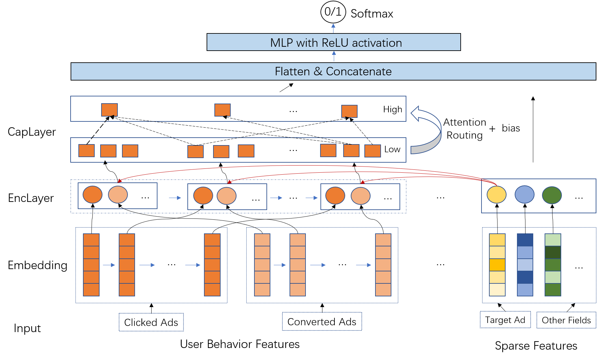

## Attentive Capsule Network 

我们提出了一种使用注意力胶囊网络进行CTR/CVR预估的工作。

### 模型结构

用户的兴趣存在并交叉于用户历史点击和转化数据中，如何利用当前广告和用户历史点击转化行为的关联性显得极为重要。比如说用户历史中不同时间段都点击过这种类型的广告，说明他对此类型广告曾经或者阶段性感兴趣，从而可能产生当前转化行为（比如社交app，游戏）。传统的模型对于用户历史行为只使用max或者mean池化，损失了序列特征信息。最近，为了建模序列特征，一些深度学习模型被相继提出，比如DIN，DIEN，DSIN等。然而，DIN建模没有考虑时序演化，基于RNN序列建模的DIEN没有考虑到序列内在结构且两层的gru显得太笨重，而基于用户行为Session的DSIN则只是手工划分历史行为阶段，忽视了兴趣的离散性和多样性（the discretization and diverse of user interests)。另一方面，胶囊网络已经在图像领域（数字识别，物体检测等）和自然语言处理任务中（文本分类，关系抽取等）证明有效， 特别多类别重叠的样例识别。

因此我们提出一种基于attention的胶囊网络（Capsule Network)，希望找到序列中有效组合信息, 并能利用attention routing 机制找出和当前广告最相关的用户兴趣特征。

* 我们使用Transformer从多个嵌入向量中提取低级序列信息。

* 通过注意力路由算法将低级特征聚类为高级兴趣表示。

模型示意图如下：



未来工作中，我们希望探索启发式或动态设置在注意力路由算法中兴趣 Capsule 的个数。

## 数据集

TC CVR数据集是根据来自广告平台的点击广告日志构建的。 从2k广告中随机抽取了2.9亿个点击的记录。 在此任务中，标签是不平衡的，用户点击的广告和转换后的广告历史记录用作行为序列。 我们将数据集分为训练，开发和测试数据集，比例为8：1：1。

## 实验结果

Result of the TC CVR Dataset （主结果和Ablation Study)

| Model                                      | Logloss    | AUC        |
| ------------------------------------------ | ---------- | ---------- |
| xDeepFM                                    | 0.1123     | 0.7784     |
| DeepFM                                     | 0.1126     | 0.7759     |
| AutoInt                                    | 0.1120     | 0.7805     |
| DCN                                        | 0.1120     | 0.7800     |
| PNN                                        | 0.1121     | 0.7803     |
| DeepFM_seq                                 | 0.1128     | 0.7758     |
| Baseline                                   | 0.1119     | 0.7809     |
| Baseline_wl                                | 0.1123     | 0.7787     |
| DIN                                        | 0.1113     | 0.7861     |
| DIEN                                       | 0.1109     | 0.7877     |
| BST                                        | 0.1112     | 0.7854     |
| BST_split                                  | 0.1113     | 0.7857     |
| **Capsule_8_num(ours)**                    | 0.1106     | 0.7891     |
| **Capsule_8_num_gru (ours)**               | 0.1106     | 0.7896     |
| **Capsule_8_num_transformer   (ours)**     | 0.1105     | 0.7898     |
| **Capsule_8_num_att (ours)**               | 0.1107     | 0.7890     |
| **Capsule_8_num_gru_att (ours)**           | 0.1105     | 0.7899     |
| **Capsule_8_num_transformer_split (ours)** | 0.1113     | 0.7859     |
| **Capsule_8_num_trnasformer_att  (ours)**  | **0.1104** | **0.7911** |

## 如何运行

首先按照requirement.txt安装依赖。

### 公开数据集

在公开数据集[Advertising Dataset](https://tianchi.aliyun.com/dataset/dataDetail?dataId=56)上的实验代码在acn_for_adv_dataset文件夹下

`python train_sess_capsule.py`  以及 `python train_capsule.py`

注：保证处理完成的数据集在`cephfs`目录下，读者可以自行修改数据路径。 处理数据参考[这里](<https://github.com/shenweichen/DSIN>)。

### 内部数据集

在内部数据集TC-CVR上的实验代码在acn_for_cvr文件夹下

由于数据量较大，为了方便，我们虚拟了一个小的数据集在data目录，读者可以自行处理数据放在`cephfs`的相应路径，目前不支持`hdfs`数据直接读取。

训练和测试命令：

本地运行：

```shell
python cvr_stream.py
```

Tesla运行:

```shell
python cvr_stream.py \
	--train-dir=/cephfs/group/sng-gdt-isd-conversion/dongfangli/data/cvr/stream_data/pdata_20190506_0510_train.csv \
	--val-dir=/cephfs/group/sng-gdt-isd-	conversion/dongfangli/data/cvr/stream_data/pdata_20190506_0510_val.csv \
	--test-dir=/cephfs/group/sng-gdt-isd-conversion/dongfangli/data/cvr/stream_data/pdata_20190506_0510_test.csv \
	--save-dir=/cephfs/group/sng-gdt-isd-conversion/dongfangli/checkpoints \
	--log-dir=/cephfs/group/sng-gdt-isd-conversion/dongfangli/log_v4 \
	--model=capsule_hdfs \
	--mode=train \
	--nrows=-1 \
	--epochs=5 \
	--batch-size=1024 \
	--train-size=232682604 \
	--test-size=29085326 \
	--val-size=29085326 
```